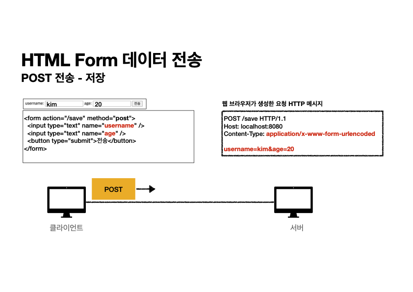

# HTTP 메서드 활용

## 클라이언트에서 서버로의 데이터를 전달하는 방식

> 1. 쿼리 파라미터를 통한 데이터 전송
>     - GET
>     - 검색어 정렬 필터
> 2. 메시지 바디를 통한 데이터 전송
>     - POST, PUT, PATCH
>     - 회원가입, 상품 주문, 리소스 등록, 리소스 변경

## 클라이언트에서 서버로 데이터를 전송하는 예시
### 정적 데이터 조회


정적 데이터는 일반적으로 쿼리 파라미터 없이 리스소 경로로 단순하게 조회가 가능하다 !

### 동적 데이터 조회


검색어(필터), 정렬조건 등 추가적인 조건을 통해 조회하는 경우 쿼리파라미터를 이용한다.
서버는 쿼리파라미터의 key, value값을 적절히 이용해 조건에 맞는 데이터를 반환한다.

> ! HTTP 스펙상 GET 요청 간 Message Body 를 사용해 메시지를 전송할 수 있지만, 실무에서는 권장되지 않는다.


### HTML Form 데이터 전송
#### POST 전송


`<form>` 태그를 사용해 요청을 보내면, 지정한 action URL과 method 속성에 따라 HTTP 요청이 생성된다.
사용자가 입력한 `<input>` 필드 값은 application/x-www-form-urlencoded 형식으로 인코딩되어 요청의 본문(body) 에 포함된다.
이때, HTTP 요청의 Content-Type 헤더는 application/x-www-form-urlencoded로 설정되며, 브라우저는 username=kim&age=20과 같은 형식으로 데이터를 전송한다.

> Q : x-www-form-urlencoded 가 뭔가요 ?

> A:  application/x-www-form-urlencoded는 HTML 폼 데이터를 key=value 형태로 변환해 HTTP 요청 본문(body)에 포함하는 인코딩 방식이다.
일반적으로 POST 요청에서 사용되며, GET 요청이 데이터를 Query String 형태로 보내는 것과 대비된다.


#### GET 전송


사용자가 입력한 `<input>` 필드 값은 Query String 형태로 변환되어 URL에 포함된다.
이때, HTTP 요청의 Content-Type 헤더는 따로 설정되지 않으며, 브라우저는 GET /members?username=kim&age=20과 같은 형식으로 데이터를 전송한다.

#### mulitipart/form-data

username과 age 같은 텍스트 데이터뿐만 아니라 바이너리 파일까지 전송할 때는 multipart/form-data 형식을 사용해야 한다.
웹 브라우저는 자동으로 boundary를 사용해 파일과 텍스트 데이터를 구분하며, 이를 통해 여러 개의 Content-Type을 포함한 요청을 보낼 수 있다.
주로 바이너리 데이터 전송에 활용된다.

### HTTP API 데이터 전송


HTTP API를 통한 데이터 전송은 서버 간 통신, 모바일 앱(iOS, Android) 및 웹 클라이언트(React, Vue.js 등)와의 데이터 교환에 활용되며,POST, PUT, PATCH는 요청 본문(Body)을 통해 데이터를 전송하고, GET은 Query String 형식으로 데이터를 전달하며, 일반적으로 application/json이 표준으로 사용된다.


## HTTP API 설계
### API 설계 - POST 기반 등록
```java
- 회원 목록 /members -> GET
- 회원 등록 /members -> POST
- 회원 조회 /members/{id} -> GET
- 회원 수정 /members/{id} -> PATCH, PUT, POST
- 회원 삭제 /members/{id} -> DELETE
```

### API 설계 - PUT 기반 등록
```java
- 파일 목록 /files -> GET
- 파일 조회 /files/{filename} -> GET
- 파일 등록 /files/{filename} -> PUT
- 파일 삭제 /files/{filename} -> DELETE
- 파일 대량 등록 /files -> POST
```

### POST와 PUT 기반 등록의 차이 - 컬렉션 vs 스토어
| 구분  | POST | PUT |
|------|------|------|
| **URI 지정 주체** | 서버가 URI 생성 | 클라이언트가 URI 지정 |
| **예제** | `POST /members` | `PUT /files/star.jpg` |
| **리소스 관리 방식** | 컬렉션(Collection) | 스토어(Store) |
| **URI 관리 주체** | 서버가 관리 | 클라이언트가 관리 |
| **응답 코드** | `201 Created` + `Location` 헤더 | `201 Created` (신규 생성) 또는 `200 OK` (업데이트) |
| **사용 예시** | 회원 등록 (`/members`) | 파일 업로드 (`/files/{filename}`) |

POST를 이용해 데이터를 등록할 때는 클라이언트의 요청을 서버에서 받아 리소스를 만들어준다. 이 때 클라이언트는 등록될 리소스의 URI를 모른다. <u>**서버가 리소스 URI를 생성하고 관리**</u>하는 형태를 **컬렉션이라고한다.**

PUT기반 등록은 클라이언트가 리소스 URI를 알고 있다. 클라이언트가 직접 리소스의 URI를 지정한다는 것은 클라이언트가 리소스 URI를 관리한다는 뜻이다. <u>**클라이언트가 리소스의 URI를 알고 관리**</u>하는 형태를 **스토어라고 한다.**

> 대부분 POST 기반의 컬렉션을 사용한다.

---

### HTML FORM 사용

순수 HTML FROM만을 이용할 때는 <u>**GET, POST만을 지원**</u>한다. 이러한 제약사항을 해결하기 위해 리소스 경로에 동사를 사용하는 컨트롤 URI를 이용한다.
>주의: 최대한 Resource 중심으로 URI를 설계하되, 필요할 경우에만 컨트롤 URI를 사용하도록 하자.

```java
회원 목록      /members (GET)
회원 등록 폼    /members/new (GET)
회원 등록      /members/new, /members (POST)
회원 조회      /members/{id} (GET)
회원 수정 폼    /members/{id}/edit (GET)
회원 수정      /members/{id}/edit, /members/{id} (POST)
회원 삭제      /members/{id}/delete (POST)
```

**POST**를 통해 회원 등록 시 폼(GET)과 URI를 맞추거나, 별도의 **컬렉션 형태(/members)로 URI를 생성**할 수 있다.
이때, URI를 동일하게 맞추면, 등록 중 문제가 발생해 폼으로 돌아갈 때 경로를 변경할 필요가 없어 편리하다.

회원 수정 폼은 **조회 기능**이므로 **GET**을 사용하며, 수정 요청 시에도 **폼의 URI와 맞추거나 컬렉션 형태로 URI를 생성**할 수 있다.

또한, HTML FORM은 DELETE 메서드를 지원하지 않으므로, 회원 삭제 시 **POST를 사용하고 delete를 포함한 컨트롤 URI를 활용**해야 한다.
