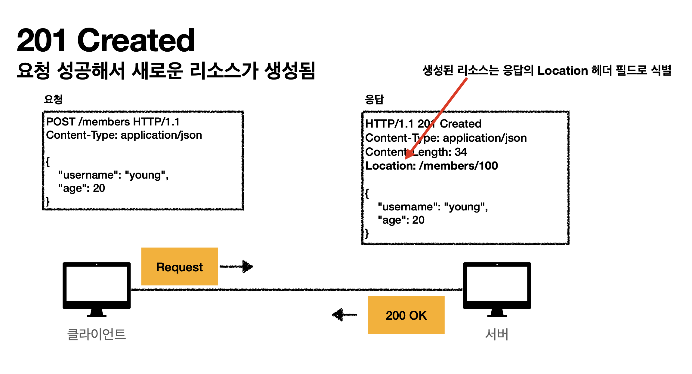
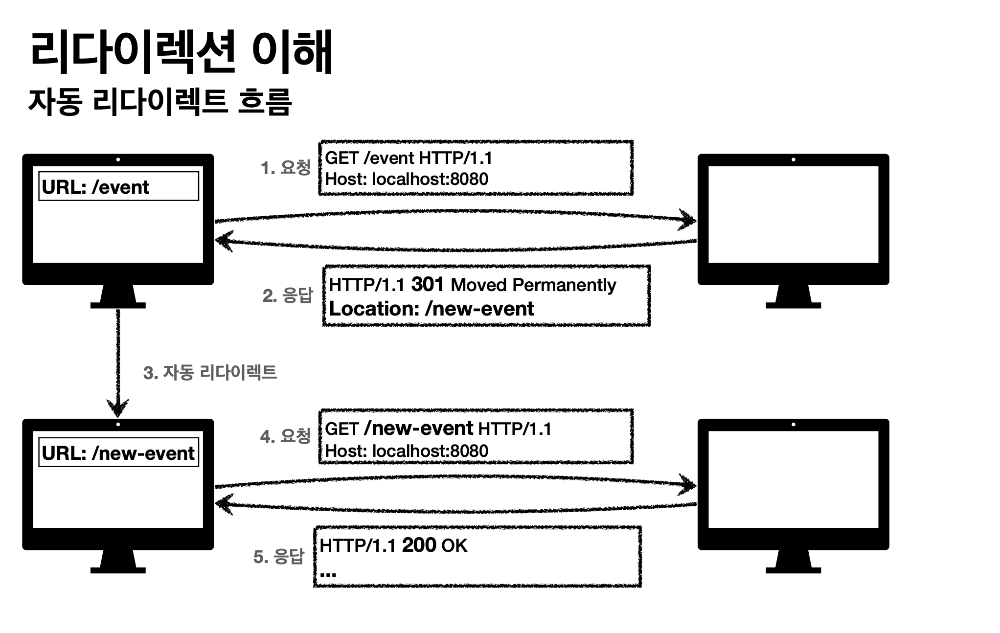
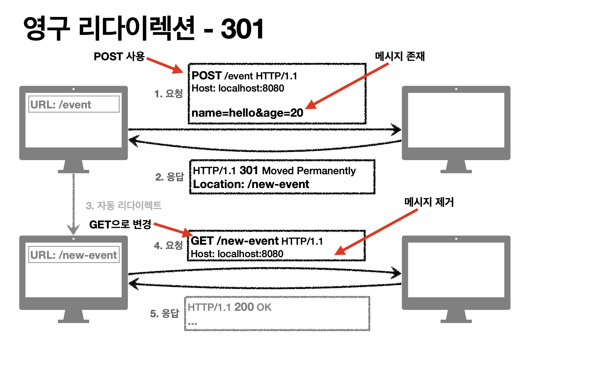
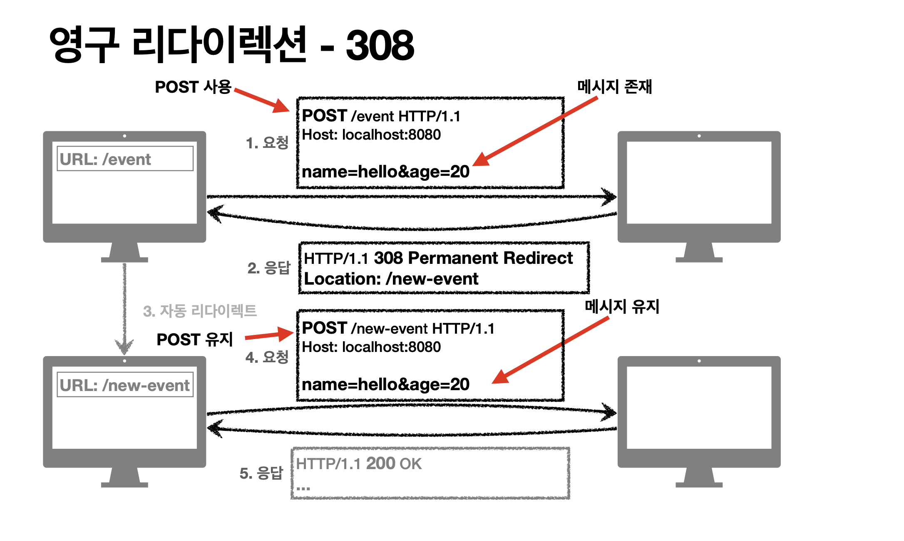
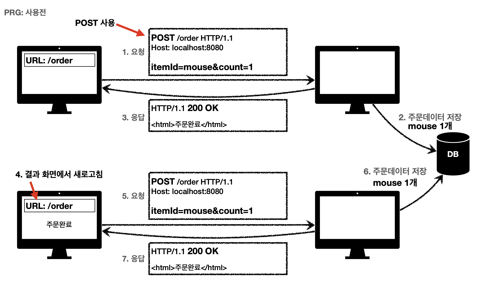
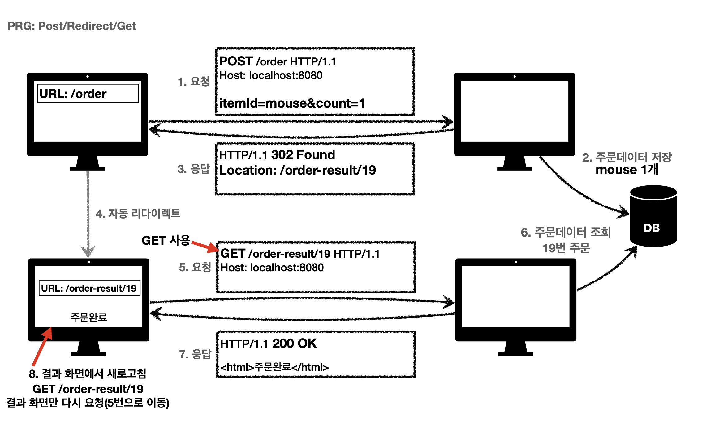

# HTTP 상태 코드

## 상태 코드란?

클라이언트가 보낸 요청에 대한 처리 상태를 나타내는 코드

## HTTP 상태 코드 개요

| 범주 | 설명 |
| --- | --- |
| 1xx (Informational) | 요청이 수신되어 처리 중 |
| 2xx (Successful) | 요청 정상 처리 |
| 3xx (Redirection) | 요청을 완료하려면 추가 행동 필요 |
| 4xx (Client Error) | 클라이언트 오류로 인해 요청 수행 불가 |
| 5xx (Server Error) | 서버 오류로 인해 요청 처리 불가 |

---

## 1xx (Informational)

- 요청이 수신되어 처리 중
- 실무에서 거의 사용되지 않음

---
## 2xx (Successful)

### 200 OK

- 요청 성공

### 201 Created

- 새로운 리소스 생성됨
- HTTP 헤더에 생성된 리소스의 위치 포함 (`Location: /members/100`)

### 202 Accepted

- 요청이 접수되었지만, 처리는 완료되지 않음
- 배치 처리 등에 사용
- **예시:** 예약 요청이 승인 대기 상태일 때

### 204 No Content

- 요청 수행 성공, 응답 본문 없음
- **예시:** 웹 문서 편집기에서 저장 버튼을 눌러도 같은 화면 유지

---

## 3xx (Redirection)

- 요청을 처리하기 위해 추가 조치가 필요할 때

### 리다이렉션 이해

응답 결과에 `Location` 헤더를 포함한 경우, 해당 위치로 자동 이동

- **영구 리다이렉션 (Permanent Redirection)**
- **일시 리다이렉션 (Temporary Redirection)**
- **특수 리다이렉션 (Cache Redirect)**
---

### 영구 리다이렉션 (Permanent Redirection)

- 특정 리소스의 URI가 영구적으로 이동됨
- **예시:** `http://example.com/old-page` → `http://example.com/new-page`

 

#### 301 Moved Permanently

- 특정 리소스의 URI가 영구적으로 이동됨
- **리다이렉트 시 요청 메서드가 GET으로 변하고, 본문이 제거될 수 있음**

 

#### 308 Permanent Redirect

- 301과 동일하지만, **요청 메서드와 본문 유지**

---

### 일시 리다이렉션 (Temporary Redirection)

- 리소스가 일시적으로 이동됨
- **PRG (Post/Redirect/Get) 패턴을 적용하여 중복 요청 방지 가능**

#### 302 Found

- 일시적인 리다이렉션
- **리다이렉트 시 요청 메서드가 GET으로 변하고, 본문이 제거될 수 있음**

#### 307 Temporary Redirect

- 302와 기능은 같지만, **요청 메서드와 본문 유지**

#### 303 See Other

- 302와 유사하지만, **리다이렉트 시 요청 메서드가 GET으로 변경**

 

### PRG 패턴 (Post/Redirect/Get)

**PRG 사용 전**

사용자가 주문을 하고 새로고침을 하면 POST 요청이 다시 전송되어 중복 주문이 발생할 수 있음.

**PRG 사용 후**

POST 요청 후 GET 요청으로 전환하여 중복 요청을 방지할 수 있음.

> Q: PRG 패턴은 언제 사용할까?  
> A: 상품 주문 시 새로고침을 하면 POST 요청이 다시 전송되어 중복 주문이 발생할 수 있음
PRG 패턴을 적용하면 POST 요청 후 GET 요청으로 전환하여 중복 요청을 방지할 수 있음
---

## 기타 리다이렉션 (Cache Redirect)

- 결과 대신 클라이언트가 로컬 캐시를 사용하도록 유도함

### 300 Multiple Choices

- 잘 사용 안 함

### 304 Not Modified

- 캐시를 목적으로 사용
- 클라이언트에게 리소스가 수정되지 않았음을 알리고, 기존 캐시된 데이터를 사용하도록 함
- **예시:** 웹사이트에서 동일한 이미지 파일을 요청할 경우, 변경되지 않았다면 서버가 304 응답을 보내고 클라이언트가 기존 캐시를 사용
- **조건부 GET, HEAD 요청 시 사용됨**

---

## 4xx (Client Error)

### 400 Bad Request

- 요청 구문 오류

### 401 Unauthorized

- 인증 필요
- **예시:** 로그인 요청 필요

### 403 Forbidden

- 인증은 되었지만, 접근 권한 없음

### 404 Not Found

- 요청한 리소스가 존재하지 않음
- 클라이언트가 권한이 부족한 리소스에 접근할 때 해당 리소스를 숨기고 싶을 때 사용

> Q: 403과 404의 차이는?  
> A: 403은 접근 권한이 없을 때, 404는 리소스가 존재하지 않을 때 사용됨

---

## 5xx (Server Error)

### 500 Internal Server Error

- 서버 내부 오류

### 503 Service Unavailable

- 서버 과부하 또는 유지보수로 인해 일시적으로 사용 불가
- `Retry-After` 헤더를 포함하여 복구 예상 시간 제공 가능

### 505 HTTP Version Not Supported

- 서버에서 지원하지 않는 HTTP 버전 사용

---

## 참고 자료

[MDN - HTTP 상태 코드](https://developer.mozilla.org/ko/docs/Web/HTTP/Status)

