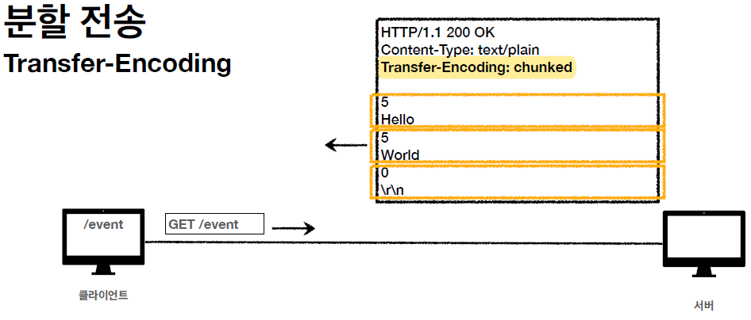

# HTTP 헤더

## HTTP 헤더 용도

HTTP 전송에 필요한 모든 부가 정보를 말한다.
> EX ) 메시지 바디의 내용, 메시지 바디의 크기, 압축, 인증, 요청 클라이언트, 서버 정보, 캐시 관리 정보 ...

이러한 표준 헤더는 정말 맣고, 필요시 개발자가 임의로 추가 가능하다.

### RFC7230

현재 HTTP 최신 버전은 RFC7230 버전이다.

해당 버전은 메시지 본문(=payload) 을 통해 표현 데이터를 전달한다.

> 표현 = 표현 헤더 + 표현 데이터

이때 표현 헤더는 데이터 유형, 길이 압축 정보 등등 표현 데이터를 해석할 수 있는 정보를 제공한다.

> Q : 왜 표현이라고 얘기하는 걸까 ?

> A : 예를 들어, 회원 데이터를 조회한다고 가정해 보자. 실제로 DB에서 회원 정보를 조회한 후 HTTP를 통해 클라이언트에 전달할 때, 이 데이터를 HTML로 “표현”할 수도 있고, JSON으로 “표현”할 수도 있다. 즉, 같은 리소스라도 다양한 방식으로 전달될 수 있기 때문에, 이를 명확하게 구분하기 위해 “표현”이라는 용어를 사용하는 것이다.

---

## 표현

표현 헤더는 요청, 응답 모두 사용한다.

### Content-Type

`Content-Type`  은 쉽게 말해서 "body 에 들어가는 내용이 뭐야 ?" 라는 것이다.

즉, `Content-Type` 은 표현 데이터의 형식을 설명한다. 보통 미디어 타입, 문자 인코딩 등을 여기에 표시한다.

> ex )
> - text/html; charset=utf-8
> - application/json
> - image/png

### Content-Encoding

`Content-Encoding` 은 표현 데이터를 압축하는 방식이다.
데이터를 전송하는 측에서 메시지 바디를 압축하면, 수신 측은 이를 해제해야 한다.
따라서 클라이언트가 압축 형식을 인식할 수 있도록 `Content-Encoding` 에 압축 방식을 명시한다.

> ex> gzip, deflate, identity

### Content-Language

Content-Language는 표현 데이터의 자연 언어를 표시한다.
>ex> ko, en, en-US

### Content-Length

Content-Length는 표현 데이터의 길이를 의미한다.
길이는 바이트 단위이다.

---

## 콘텐츠 협상

협상은 **클라이언트가 선호하는 표현을 서버에 요청하는 것**이다.

클라이언트가 선호하는 표현을 서버에 제시하고, 서버는 환경이 되는 한 그 클라이언트의 선호도를 맞춰주려고 노력한다.
이러한 과정이 일상의 협상 처럼 보인다.

협상은 클라이언트의 선호를 서버로 요청하기 때문에, 요청 시에만 사용이 가능하다.

| 협상 종류         | 설명                           |
|------------------|------------------------------|
| `Accept`        | 클라이언트가 선호하는 미디어 타입 |
| `Accept-Charset` | 클라이언트가 선호하는 문자 인코딩 |
| `Accept-Encoding` | 클라이언트가 선호하는 압축 인코딩 |
| `Accept-Language` | 클라이언트가 선호하는 자연 언어 |

### Accept-Language 작동 방식

위 예시처럼 클라이언트가 한국어를 선호한다고 서버에 알리면, 서버는 자신이 지원하는 언어 목록을 확인한 후, 한국어를 지원할 경우 해당 언어로 데이터를 반환한다.

하지만, 세상은 녹록지 않다. 모든 것이 뜻대로 되지 않는다.
클라이언트가 요청한 언어를 안타깝게도 서버에서 지원하지 않으면, 서버는 default 언어로 응답을 반환한다.

그렇다면 이 문제를 어떻게 해결할 수 있을까 ?

### 협상과 우선순위

이를 해결하기 위해 **Quality Values(q)** 를 사용한다.

**Quality Value(q)란?**
- 0과 1 사이의 유리수로, 우선순위를 나타낸다.
- 값이 1에 가까울수록 우선순위가 높다.
- 생략하면 기본값으로 1이 지정된다.

**Quality Value를 사용하면** 위와 같은 문제를 어느 정도 해결할 수 있다.

이번엔 Accept-Language 대신 Accept를 보자.

위의 경우(Quality Value 사용 X)에는 구체적으로 요구할수록 우선순위가 높아진다.
따라서 우선순위는 아래와 같다.

> 1. text/plain;format=flowed
> 2. text/plain
> 3. text/*
> 4. */*

이때 Quality Value를 사용하면 더욱 명확해진다.

---

## 전송 방식
### 단순 전송

단순 전송은 **요청하면 다 전송해주는 방식으로 전송 콘텐츠에 대한 길이값을 단순히 요청하고 다 받는 것**이다.

### 분할 전송

하지만 **전송해야 할 데이터 크기를 미리 알 수 없는 경우**가 있을 것이다. 이때 **Transfer-Encoding: chunked** 방식을 사용하는 분할 전송 방식을 사용할 수 있다.

서버가 분할해서 데이터를 보내주면, 클라이언트는 오는 순서대로 데이터를 받고 바로바로 화면에 보여준다.

이떄 분할 전송은 `Content-Length` 를 넣으면 안된다. 왜냐하면 각각 쪼개진 길이를 모르기 때문 !!

> ex)  스트리밍 데이터, 동적으로 생성되는 콘텐츠 등

### 압축 전송

압축 전송은 **서버에서 메시지를 압축해서 전송하는 것**을 말한다.
이 때 압축 방식을 표기하면, 서버에서 표기된 압축 방식을 확인하고 알맞은 방식으로 압축 해제를 진행할 수 있다.

### 범위 전송

범위 전송은 **메시지의 범위를 바이트 단위 기준으로 정하여 그 부분만 전송하는 방식**이다.

예를 들어 원래 보내던 전송이 중간에 끊겼을 때, 다시 처음부터 보내면 낭비가 있으므로 끊긴 부분부터 범위를 설정하여 재전송한다.

---

## 일반 정보
HTTP 헤더의 일반 정보에는 `From` `Referer` `User-Agent` `Server` `Date` 와 같은 속성들이 있다.

### From
`From` 은 **유저의 이메일 정보**를 말한다.

일반적으로 잘 사용되지는 않고, 검색 엔진 같은 곳에서 사용한다.

**요청에서만** 사용한다

### Referer
`Referer` 은 **현재 요청된 페이지의 이전 웹 페이지 주소**를 말한다.

이 `Referer` 을 사용해서 유입 경로를 분석할 수 있다.

**요청에서만** 사용한다.

> ex) google -> wiki => 이때 goole 의 Referer 은 wiki.

### User-Agent

`User-Agent` 는 **클라이언트의 애플리케이션 정보**를 말한다. (웹 브라우저 정보 등)

`User-Agent` 를 통해 통계 정보를 내거나, 어떤 종류의 브라우저에서 장애가 발생하는지 파악할 수 있다.

**요청에서만** 사용한다.

### Server

`Server` 는 **요청을 처리하는 ORIGIN 서버의 소프트웨어 정보**를 말한다.

> Q : ORIGIN 서버가 뭔가요 ?

> A : HTTP 통신에서는 요청이 프록시 서버, 캐시 서버 등 여러 중간 서버를 거칠 수 있다. 하지만 이러한 중간 서버가 아닌, 실제 요청을 처리하는 원본 서버를 ORIGIN 서버라고 한다. 즉, ORIGIN 서버는 HTTP 요청에 최종적으로 응답하는 진짜 서버이다.

**응답에서만** 사용한다.

### Date

`Date` 는** 메시지가 발생한 날짜와 시간**을 말한다.

**응답에서만** 사용한다. (과거에는 요청에서도 사용)

---

## 특별한 정보
HTTP 헤더의 특별한 정보에는 `Host` `Location` `Allow` `Retry-After` 와 같은 속성들이 있다.

### Host

`Host` 는 **요청한 호스트 정보(도메인)**을 말한다.

HTTP 통신에서 이런 경우가 있다.

- 하나의 서버가 여러 도메인을 처리해야 할 때
- 하나의 IP 주소에 여러 도메인이 적용되어 있을 때

이러한 경우, Host를 활용해서 해결할 수 있다.

**요청에서 필수**로 사용해야 한다.

### Location
`Location` 은 페이지 리다이렉션 위치를 말한다.

웹 브라우저는 3xx 응답의 결과에 `Location` 헤더가 있으면, `Location` 위치로 자동 이동한다.

또한 201(Created) 코드에서도 요청에 의해 생성된 리소스 URI를 반환할 때 사용한다.

### Allow
`Allow` 는 **허용 가능한 HTTP 메서드**를 말한다.

URI 경로는 있지만 지원하지 않는 HTTP 메서드로 요청할 경우, 405 (Method Not Allowed) 응답 코드와 함께 허용된 메서드 목록을 함께 전달한다.

### Retry-After
`Retry-After` 는 유저 에이전트가 다음 요청을 하기까지 기다려야 하는 시간을 말한다.
`Retry-After` 을 통해 서비스가 언제까지 불능인지를 알 수 있다.

> ex )
> - 서버 과부하 (503 Service Unavailable)
> - 서버 유지보수 (503 Service Unavailable)
> - Rate Limiting (429 Too Many Requests)

위 사진처럼 날짜, 초 단위 표기 두 가지 방식이 있다.

---

## 인증
HTTP 헤더의 인증 정보에는 `Authorization` `WWW-Authenticate` 와 같은 속성들이 있다.

### Authorization
`Authorization` 은 **클라이언트 인증 정보를 서버에 전달하는 것**을 말한다.

> ! 인증 방식마다 들어가는 값은 모두 다르다.

### WWW-Authenticate
`WWW-Authenticate` 는 **리소스 접근 시 필요한 인증 방법을 정의한 것**을 말한다.

만약 접근했는데 인증에 문제가 있다면, 401 Unauthorized 응답을 남기고 함께 사용한다.

)

" 위 정보들을 참고해서 인증을 다시 해줘 ~ " 라는 뜻이다.

---

## 쿠키
쿠키란 웹 서버에서 생성하여, 브라우저에 전송 & 저장되는 작은 텍스트 파일이다.

쿠키를 사용할 때는 set-cookie, cookie 두 가지를 사용함
> Set-Cookie : 서버가 클라이언트로 쿠키 전달 (응답)
> Cookie: 클라이언트가 서버에서 받은 쿠키를 저장하고, HTTP 요청시 서버로 전달

### 쿠키 활용

HTTP 는 무상태(Stateless) 프로토콜이라고 배웠다.
그래서 우리는 매번 데이터를 HTTP 요청에 같이 보냈어야 했다.
)

HTTP의 무상태 특성상, 각 요청은 독립적이며 서버는 이전 요청의 상태를 기억하지 않는다. 따라서 인증 정보를 함께 전송하지 않으면, 서버는 매 요청마다 우리가 새로울 것이다. 이로 인해 서버의 기억을 되살려주기 위해 매 요청 시마다 “홍길동”과 같은 사용자 정보를 함께 보내야 한다.

이거 낭비가 크다.. 보안적 이슈도 있고 여러모로 문제가 많다.

이러한 문제를 쿠키가 해결해준다.

)

이처럼 처음 로그인할때 서버에서 유저 관련 정보를 Set-Cookie를 통해 쿠키로 만들어 전달한다.

이후 브라우저에서는 해당 정보를 쿠키 저장소에 저장해둔다.

그리고 아래처럼 활용한다.

)

클라이언트는 매 HTTP 요청마다 쿠키 저장조에서 쿠리르 조회하여 자동으로 해당 유저 정보를 포함한 쿠키를 서버에 전달한다.

그런데 쿠키도 조심해야할 게 있다.
아무래도 노출이 높은 편이다 보니, **보안에 민감한 데이터는 쿠키에 저장하면 안된다.**

또한 쿠키는 네트워크 트래픽을 추가로 유발한다.
그러므로 **최소한의 정보**만 활용하자.
만약 서버에 전송하지 않고, 웹 브라우저 내부에서만 데이터를 저장하고 싶다면, 웹 스토리지(LocalStorage, SessionStorage)를 활용하자.

> 쿠키 사용처 : 사용자 인증 세션 관리, 광고 정보 트래킹 등

### 쿠키의 생명주기

Set-Cookie에는 생명주기와 관련된 옵션 두가지가 있다.

- expires : 만료일이 되면 쿠키 자동 삭제 (GMT 기준으로 설정)
- max-age : 지정 시간 후 쿠키 자동 삭제 (0 또는 음수로 설정하면 즉시 쿠키 삭제)

> Q :  expires 와 max-age 는 무슨 차이일까 ?

> A : expires 는 쿠키의 만료 시간을 절대 시간으로 설정한다. 특정 날짜와 시간을 GMT(UTC) 형식으로 지정하는 것이다. max-age 는 쿠키의 만료 시간을 상대적인 시간으로 설정한다. 설정된 값은 쿠키가 생성된 시간부터 경과한 초 단위로 계산되는 것이다.

### 쿠키의 종류

- 세션 쿠키 : 만료 날짜 생략하면 브라우저 종료시 까지만 유지
- 영속 쿠키 : 만료 날짜 입력하면 해당 날짜까지 오래 유지

### 쿠키 : 도메인
쿠키는 특정 도메인에만 적용되도록 설정할 수 있다. 만약 쿠키가 모든 사이트에서 자동으로 생성된다면 보안상 문제가 발생할 수 있으니, 쿠키가 사용할 도메인을 정확히 지정해야 한다.

예를 들어, domain=example.or g로 설정하면 example.org 뿐만 아니라 dev.example.org 같은 서브 도메인도 쿠키에 접근할 수 있다.

반면, 별다른 설정을 하지 않으면 쿠키는 example.org 에서만 유효하고 서브 도메인에서는 접근할 수 없다.

### 쿠키 : 경로

쿠키에 경로 옵션을 설정하면, **해당 경로를 포함한 하위 경로에서만 쿠키에 접근**할 수 있다.
즉, 도메인뿐만 아니라 경로도 지정할 수 있다는 뜻이다.

#### 예시:
- `path=/home`으로 설정한 경우:
    - `/home` -> 쿠키 접근 가능
    - `/home/level1` -> 쿠키 접근 가능
    - `/home/level1/level2` -> 쿠키 접근 가능
    - `/hello` -> 쿠키 접근 불가능

일반적으로는 `path=/`로 설정하여 루트 경로부터 모든 페이지에서 쿠키에 접근할 수 있도록 설정한다.

### 쿠키 : 보안

쿠키는 `Secure`, `HttpOnly`, `SameSite` 속성으로 보안을 강화할 수 있다.

- **Secure**  
  `Secure` 속성을 적용하면, 쿠키는 오직 HTTPS 연결을 통해서만 전송된다. 기본적으로 쿠키는 HTTP와 HTTPS 모두에서 전송되지만, `Secure`를 설정하면 보안이 강화된다.

- **HttpOnly**  
  `HttpOnly` 는 XSS 공격을 방지하기 위해 사용된다. 기본적으로 JavaScript에서는 쿠키에 접근할 수 있지만, `HttpOnly`를 설정하면 JavaScript에서 쿠키에 접근할 수 없게 된다. 이렇게 하면 쿠키는 오직 HTTP 전송에서만 사용되어 보안이 강화된다.

- **SameSite**  
  `SameSite` 는 XSRF 공격을 방지하는 데 사용된다. 쿠키에 설정된 도메인과 요청을 보내는 도메인이 같은 경우에만 쿠키를 전송하도록 제한한다. 이를 통해 다른 사이트에서 오는 요청에 대해 쿠키가 자동으로 전송되는 것을 방지할 수 있다.

---

## 번외 : XSS 와 XSRF 란 ?

### XSS (Cross-Site Scripting)

XSS는 공격자가 웹사이트에 악성 코드(주로 JavaScript)를 넣어서, 사용자의 브라우저에서 그 코드가 실행되도록 하는 공격이다.

> ex )
> - 사용자가 댓글을 사이트에 남긴다.
> - 공격자는 그 사이트의 댓글에 악성 JavaScript 코드를 삽입한다.
> - 다른 사람이 그 댓글을 읽으면, 댓글 안의 악성 코드가 사용자의 브라우저에서 실행된다.
> - 이 코드가 사용자의 쿠키를 훔쳐가면, 공격자가 그 쿠키를 사용해서 사용자의 로그인 상태를 탈취할 수 있다.

**결국, XSS는 웹페이지에 악성 스크립트를 삽입해서 사용자의 브라우저에서 이를 실행시키는 공격이다.**

### XSRF (Cross-Site Request Forgery)

XSRF는 공격자가 사용자의 로그인 상태를 악용해서, 사용자가 원하지 않는 요청을 다른 사이트로 보내게 만드는 공격이다.

> ex )
> - 사용자가 온라인 뱅킹 사이트에 로그인한다.
> - 그때 악성 사이트에 접속했는데, 그 사이트가 자동으로 사용자의 은행 계좌에서 돈을 이체하는 요청을 보낸다.
> - 사용자가 로그인된 상태에서, 브라우저는 이미 로그인 정보가 들어있는 쿠키를 자동으로 포함시켜서 은행에 요청을 보내버린다.
> - 그래서 공격자는 사용자의 의도와 상관없이 사용자의 계좌에서 돈을 이체할 수 있게 되는 것이다.

**결국, XSRF는 공격자가 사용자가 의도하지 않은 요청을 다른 사이트에 보내게 만드는 공격이다.**