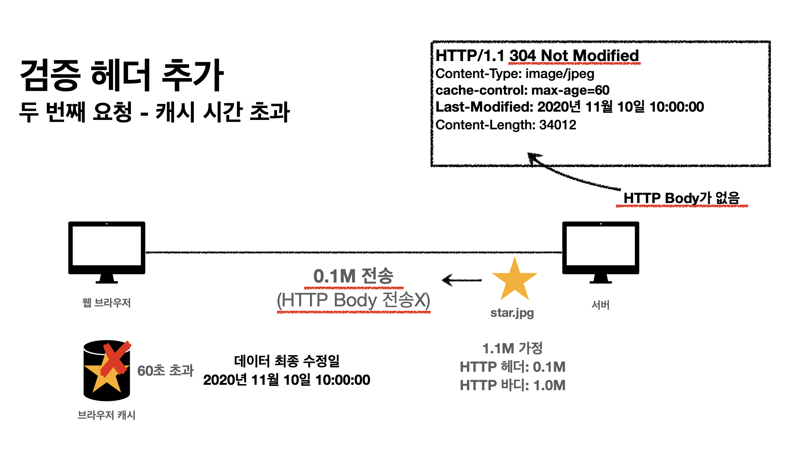

# HTTP 헤더2 - 캐시와 조건부 요청

## 캐시 기본 동작

### 캐시가 없을 때

- 데이터가 변경되지 않아도 네트워크를 통해 다시 다운로드해야 함 → 브라우저 로딩 속도 저하
- 인터넷 네트워크는 메모리나 하드디스크보다 상대적으로 비용이 높음

### 캐시가 적용되었을 때

- `Cache-Control`을 통해 캐시 유효시간 설정 가능
- 유효시간 동안 네트워크를 사용하지 않음 → 브라우저 로딩 속도 향상
- 인터넷 네트워크 사용량 감소

### 캐시 시간이 초과되었을 때

- 서버에서 데이터를 다시 조회하고, 캐시를 갱신
- 네트워크 다운로드가 다시 발생
- 클라이언트와 서버의 데이터가 같아도 변경되지 않았다면 다시 다운로드 발생

### 캐시 시간 초과 시 로컬 캐시 재사용

- 기존 데이터가 변경되지 않았을 경우, 검증 헤더를 사용하여 로컬 캐시를 재사용할 수 있음
- 클라이언트와 서버가 가진 데이터가 동일함이 검증된 경우에만 가능

## 검증 헤더와 조건부 요청

### 첫 번째 요청 시 - 검증 헤더 추가

- `Last-Modified`(데이터 최종 수정일)를 응답 헤더에 포함
- 클라이언트는 `Last-Modified` 값을 캐시에 저장

### 두 번째 요청 시 - 검증 헤더 추가 + 조건부 요청

- `Last-Modified` 비교 시 변경되지 않았다면 `304 Not Modified` 응답
- 클라이언트는 기존 캐시된 데이터를 재사용

> **Q: 캐시에 저장된 데이터를 재활용한다는 것은 만료된 데이터가 남아 있다는 의미인가?**  
> **A:** 캐시된 데이터가 만료되었더라도 검증 과정을 거쳐 변경되지 않았음을 확인하면 재활용할 수 있음. 즉, 일부 데이터가 남아있다는 것.

### 검증 헤더

- `Last-Modified`, `ETag`를 활용하여 캐시 데이터와 서버 데이터의 일치 여부를 검증

### 조건부 요청 헤더

- `If-Modified-Since`: `Last-Modified` 값 사용
- `If-None-Match`: `ETag` 값 사용
- 조건이 만족하면 `200 OK`, 만족하지 않으면 `304 Not Modified`

### If-Modified-Since

- 이후 데이터가 수정되었을 경우 새로운 데이터 제공
- 1초 미만 단위로 캐시 조정 불가능
- 날짜 기반 로직 사용 (예: `2020년 11월 10일 10:00:00`)
- 데이터를 수정했지만 동일한 내용을 다시 저장하는 경우 날짜는 변경되지만 데이터는 같을 수 있음

> **Q: 데이터를 복사 붙여넣기 하면 수정된 날짜가 다르지만 데이터는 같은 건가?**  
> **A:** 맞음. 내용이 변하지 않아도 저장 시점이 다르면 `Last-Modified` 값은 달라질 수 있음.

### ETag, If-None-Match

- 캐시 데이터에 해시 기반의 고유한 식별자를 부여
    - 예) `ETag: "v1.0"`, `ETag: "a2jiodwjekjl3"`

- 파일의 콘텐츠가 변경될 경우 해시값이 달라지므로 새로운 캐시로 갱신됨

> **Q: Last-Modified의 단점을 보완하기 위해 ETag를 활용한다고 하는데, 어떻게 동작하는가?**  
> **A:** `Last-Modified`는 날짜 기반으로 변경을 감지하지만, `ETag`는 파일의 내용 기반으로 변경을 감지함.  
> 즉, `Last-Modified`는 파일의 내용이 변하지 않아도 수정 시간이 갱신되면 다르게 판단하지만, `ETag`는 파일의 내용이 같다면 같은 해시값을 유지하므로 불필요한 다운로드를 줄일 수 있음.

## 캐시 제어 헤더

- `Cache-Control`: 캐시 제어
- `Pragma`: HTTP 1.0 하위 호환용 캐시 제어
- `Expires`: HTTP 1.0 캐시 유효 기간

### Cache-Control - 캐시 지시어 (Directives)

- `max-age`: 캐시 유효 시간(초 단위)
- `no-cache`: 캐시 데이터를 사용하기 전에 항상 원 서버에서 검증 필요
- `no-store`: 민감한 정보가 포함된 데이터는 캐시 저장 불가 (즉시 삭제)

## 프록시 캐시

### 프록시란?

- 사용자의 요청을 대신 처리하여 서버로 전달하는 역할 (중간 역할)
- 원 서버에서 직접 데이터를 가져오는 대신 프록시 캐시 서버를 통해 가져옴

### Cache-Control - 기타 캐시 지시어

- `public`: 응답이 공용 캐시에 저장 가능
- `private`: 응답이 특정 사용자 전용 (기본값)
- `s-maxage`: 프록시 캐시에만 적용되는 `max-age`
- `Age`: 프록시 캐시에 머문 시간 (초 단위)

## 캐시 무효화

### Cache-Control - 확실한 캐시 무효화

- `no-cache`: 캐시 데이터를 사용하기 전에 항상 원 서버 검증 필요
- `no-store`: 민감한 데이터이므로 캐시 저장 불가 (즉시 삭제)
- `must-revalidate`: 캐시 만료 후 반드시 원 서버 검증 필요, 실패 시 오류 (`504 Gateway Timeout`)
- `Pragma: no-cache`: HTTP 1.0 하위 호환

> **Q: `no-cache`는 캐시를 사용할 수 있는데, 원 서버 검증이 필요하다는 것이 무슨 의미인가?**  
> **A:** 캐시를 보관하지만 사용 전에 원 서버의 검증을 거쳐야 함. 변경되지 않았다는 확인이 되면 캐시를 사용함.

### no-cache vs must-revalidate

#### no-cache

- 기본적으로 원 서버의 검증을 받아 캐시 데이터를 사용

- 네트워크 단절 시 검증을 받지 못하면 프록시 서버에서 기존 데이터를 반환할 수도 있음

> **Q: 웹 브라우저 → 프록시 캐시 서버 → 원 서버 → 프록시 캐시 서버 → 브라우저 캐시를 거쳐 클라이언트에 반환되는 흐름이 맞는가?**  
> **A:** 맞음. 프록시 캐시 서버가 상태 코드(`304 Not Modified`)만 반환하면 브라우저는 기존 캐시된 데이터를 사용함.

#### must-revalidate

- 네트워크 단절 시 검증이 불가능하면 오류를 반환함 (`504 Gateway Timeout`)
