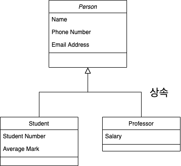

# 상속(Inheritance) 이란 ?

**상속(Inheritance)** 은 상위 클래스의 특성을 하위 클래스가 이어받아서 재사용하거나 추가, 확장하는 것을 말한다.
이 개념은 코드의 재사용 측면, 계층적인 관계 생성, 유지 보수성 측면에서 중요하다.

> Q : "계층적인 관계 생성" 이 정확히 무슨 의미일까요 ?

> A : 상속을 통해 클래스들 간에 **부모-자식 관계를 형성**하여, **상위 클래스는 공통적인 기능을 제공**하고, **하위 클래스는 그 기능을 확장**하거나 **특화**하는 구조를 구축하는 것을 의미합니다 !


---

## 상속의 필요성



상속이 필요한 이유는 프로그래밍에서 자주 발생하는 **"중복 문제"**를 해결하기 위해서이다.

예를 들어, 다양한 직업을 클래스로 표현해야 한다고 가정해 보자. 의사, 선생님, 엔지니어 등 1만 개의 직업 클래스를 각각 정의해야 한다면, **이름, 전화번호, 이메일**과 같은 공통적인 정보가 매번 반복될 것이다.
이는 마치 **1만 개의 붕어빵 틀을 만들 때** 매번 같은 형태의 **머리, 몸통, 꼬리**를 새로 설계하는 것과 같다. 이처럼 중복된 코드는 유지보수에 불편을 주고 코드가 길어지기만 한다.

하지만 **상속**을 사용하면, **공통된 특성**을 가진 부모 클래스를 설계하고, 이를 바탕으로 각 직업 클래스를 정의할 수 있다. 이는 마치 **기본 틀을 만들어 놓고**, 각 직업별로 추가적인 특징(의사: 전문 분야, 선생님: 교과목 등)을 덧붙이는 방식이다. 이렇게 하면 코드 중복을 줄일 수 있을 뿐만 아니라, 직업 클래스를 유지보수하거나 확장할 때 훨씬 효율적이다.

결국 **상속**은 **공통된 특성을 가진 객체를 체계적으로 관리하고 재사용성 높은 구조**를 설계하기 위해 필요한 중요한 개념이다. 이를 통해 프로그래머는 반복 작업을 줄이고, 더 효율적이고 가독성 높은 코드를 작성할 수 있다.

---

## 상속의 특징
자바는 **다중 상속을 지원하지 않기 때문에**, 하나의 클래스는 **오직 하나의 부모 클래스를 가질 수 있다**.
하지만 **하나의 부모 클래스는 여러 자식 클래스를 가질 수 있다**. 또한, **부모 클래스가 다른 부모 클래스를 가질 수 있다는 점에서 계층 구조를 확장하는 데 제한이 없다**.

--- 

## 상속시 메모리 구조

인스턴스를 생성하면, 실제로 인스턴스 변수에 담기는 것은 해당 인스턴스의 **메모리 주소**이다. 일반적으로 메모리 주소를 통해 해당 인스턴스를 찾아가면, 그 인스턴스에 대한 정보들이 포함된 메모리가 존재한다.

하지만 **상속** 구조에서 인스턴스를 생성하면 두 가지 인스턴스가 존재하게 된다. 첫 번째는 **자식 클래스의 인스턴스**에 대한 정보이고, 두 번째는 **부모 클래스의 인스턴스**에 대한 정보이다. 즉, **상속 관계를 가진 인스턴스는 부모 클래스의 인스턴스 정보도 함께 생성된다.**

만약 **부모 클래스**의 메서드를 호출했다고 가정해 보자. **자바는 우선 자식 클래스에서 해당 메서드를 먼저 찾고**, 만약 자식 클래스에 해당 메서드가 없다면 **부모 클래스에서 메서드를 찾는다**. 부모 클래스에도 해당 메서드가 없다면, **컴파일 에러가 발생**한다.

---

## 상속 사용법
상속을 구현하려면 부모 클래스를 정의하고, 자식 클래스는 부모 클래스를 `extends`하여 상속받는다.
자식 클래스는 부모 클래스의 **필드**와 **메서드**를 그대로 사용할 수 있으며, 필요한 경우 **오버라이딩**을 통해 메서드를 변경할 수 있다.

```java
// 부모 클래스 - Product
public class Product {
    private String name;  
    private double price; 

    public Product(String name, double price) {
        this.name = name;
        this.price = price;
    }

    public String getName() {
        return name;
    }

    public double getPrice() {
        return price;
    }

    // 상품 정보 출력 메서드
    public void displayInfo() {
        System.out.println("상품명: " + name);
        System.out.println("가격: " + price + "원");
    }
}
```
```java
// 자식 클래스 - Book
public class Book extends Product {
    private String author; 

    public Book(String name, double price, String author) {
        super(name, price);  // 부모 클래스의 생성자 호출
        this.author = author;
    }

    public String getAuthor() {
        return author;
    }

    @Override
    public void displayInfo() {
        super.displayInfo();  // 부모 클래스의 displayInfo() 메서드 호출
        System.out.println("저자: " + author);
    }
}
```
```java
// 자식 클래스 - Electronics
public class Electronics extends Product {
    private String brand;

    public Electronics(String name, double price, String brand) {
        super(name, price);  // 부모 클래스의 생성자 호출
        this.brand = brand;
    }

    public String getBrand() {
        return brand;
    }

    @Override
    public void displayInfo() {
        super.displayInfo();  // 부모 클래스의 displayInfo() 메서드 호출
        System.out.println("브랜드: " + brand);
    }
}
```
```java
public class Main {
    public static void main(String[] args) {
        // Book 객체 생성
        Book book = new Book("자바의 정석", 25000, "남궁성");
        book.displayInfo();
        System.out.println();

        // Electronics 객체 생성
        Electronics electronics = new Electronics("스마트폰", 500000, "삼성");
        electronics.displayInfo();
    }
}
```
```java
상품명: 자바의 정석
가격: 25000원
저자: 남궁성

상품명: 스마트폰
가격: 500000원
브랜드: 삼성
```

---

### 오버라이딩

**오버라이딩**은 부모 클래스의 메서드를 자식 클래스에서 재정의하는 방식이다. 부모 클래스의 메서드는 보통 일반적인 기능을 수행하지만, 특정 자식 클래스에서 이 기능을 수정할 필요가 있을 때 **오버라이딩**을 사용하여 부모 메서드와는 다른 내부 로직을 가진 동일한 이름의 메서드를 정의할 수 있다.

오버라이딩을 할 때는 특별히 `@Override`라는 **Annotation**을 사용한다.

```java
public class Product {

    ...

    // 상품 정보 출력 메서드
    public void displayInfo() {
        System.out.println("상품명: " + name);
        System.out.println("가격: " + price + "원");
    }
}
```

```java
// 자식 클래스 - Book
public class Book extends Product {

...

    @Override
    public void displayInfo() {
        super.displayInfo();  // 부모 클래스의 displayInfo() 메서드 호출
        System.out.println("저자: " + author);
    }
}
```

위의 코드에서 부모 클래스의 `displayInfo()` 메서드는 상품명과 가격을 출력하는 기본적인 기능을 담당한다. 반면, 자식 클래스인 `Book`에서는 `displayInfo()` 메서드를 **오버라이딩**하여 **저자 정보**를 추가로 출력하는 기능을 추가했다.

> **Override Annotation은 꼭 필요할까 ?**
실제로 위 코드에서 @Override를 적지 않아도 displayInfo() 는 자식의 displayInfo() 로 실행된다. 그 이유는 자식 인스턴스에서 displayInfo() 를 먼저 찾기 때문이다. 하지만 @Override를 쓰지 않았을 경우, 자바는 이 메서드가 오버라이드의 목적이라는 것을 모르기 때문에 혹여나 실수로 인한 displayInfo() 를 displayInfoooo() 로 적어도 설계과정에서 에러경고를 띄우지 않는다. 그리고나서 displayInfo() 를 호출한다면, 자식에 displayInfo() 가 없기에 부모의 displayInfo() 를 가져오게 된다. 흔한 실수는 아니겠지만 프로그래밍시 의도하지 않은 문제를 발생시킬 확률을 원천 차단할 수 있으므로 오버라이딩의 의도로 코딩한다면 해당 annotation은 그냥 습관처럼 추가하는 것이 좋을 것 같다.

오버라이딩 시, 부모 클래스의 메서드보다 자식 클래스의 메서드 접근 제어자가 더 제한적일 수는 없다. 예를 들어, 부모 클래스에서 `protected`로 정의된 메서드는 자식 클래스에서 `private`으로 오버라이드할 수 없다.

또한, `static`, `final`, `private` 메서드는 오버라이딩할 수 없으며, **생성자** 또한 오버라이드할 수 없다.

오버라이딩할 때는 부모 클래스와 자식 클래스의 메서드가 **매개변수의 타입**과 **개수**가 동일해야 한다.

---

### super

`super`는 **superclass의 super**를 나타내며, 말 그대로 **super 인스턴스**를 가리킨다.

자신의 인스턴스를 가리키는 것은 `this`이다. `this()`가 생성자를 호출하는 것처럼, `super()`는 **부모 클래스의 생성자**를 호출한다.

부모 클래스와 `extends`된 자식 클래스로 생성된 인스턴스는 메모리에 **(자식 인스턴스 + 부모 인스턴스)**의 메모리 주소를 담는다. 부모 인스턴스도 생성되어야 자식 클래스에서 사용할 수 있기 때문에 메모리에는 두 정보가 모두 생성된다. 자바는 우리가 `this`나 `super`로 호출하지 않는 한, 메서드나 필드를 찾기 위해 **자식 인스턴스를 먼저 방문하고**, 그 후 부모를 방문한다.

- `super.메서드()`를 호출하면 **자식을 거쳐서 부모로 바로 이동**한다.
- `this.메서드()`를 호출하면 부모 클래스에 대한 검색은 이루어지지 않는다.

부모 클래스의 생성자가 **기본 생성자(no parameter)**라면, 자식 클래스의 생성자는 `super()`를 통해 부모 생성자를 자동으로 호출한다.

하지만 기본 생성자가 아닌 경우, 자식 생성자에서 **`super(파라미터);`를 작성해 주어야** 부모 생성자를 호출할 수 있다.

---

## 상속의 단점

지금까지 알아본 상속의 장점을 정리하자면 다음과 같다.

```
- 코드의 확장성, 재사용성 상승
- 중복된 코드 제거가능
- 객체지향 프로그래밍에서의 다형성
```

다만, 이러한 상속에도 단점이 존재하는데...

> 상속은 코드를 재사용하는 강력한 수단이지만, 항상 최선은 아니다. 잘못 사용하면 오류를 내기 쉬운 소프트웨어를 만들게 된다.
> -이펙티브 자바 3판

### 1. 캡슐화를 깨뜨린다.

부모 클래스가 어떻게 구현되느냐에 따라 하위 클래스의 동작에 이상이 생길 수 있다.

이를 해결하려면 부모 클래스의 구현 내용을 알아야 하위 클래스에서 해결할 수 있고, 이러한 불필요한 구현 내용 노출은 캡슐화를 깨뜨리는 행위이다.


### 2. 부모 클래스의 필드와 메서드를 찾는데 불편함이 있다.

자식 클래스에서는 부모 클래스의 필드와 메소드는 보이지 않는다.

그러나 첫 번째 단점에서 설명했듯이 부모 클래스의 내부 구현을 알아야 할 일이 생긴다면, 부모 클래스에 가서 확인을 해야한다.

또한 부모의 필드를 이용할 때에도, 자식 클래스에는 해당 필드가 선언되어 있지 않은 형태이다보니 확인이 필요한 경우 불편함을 겪을 수 있다.


### 3. 부모 클래스의 변경이 자식 클래스에 영향을 미친다.

상속은 부모 클래스의 구현에 의존하기 때문에, 부모 클래스의 변경이 자식 클래스에 영향을 미칠 수 있다.

예를 들어, 부모 클래스에서 메서드를 수정하거나 새로운 메서드를 추가하거나 필드를 변경하면, 자식 클래스가 이를 상속받아 사용하는 경우 예상치 못한 동작이나 오류가 발생할 수 있다.

이러한 의존성은 시스템의 유지보수를 어렵게 만들고, 부모 클래스의 변경이 자식 클래스에 불필요한 영향을 미치게 된다.

```java
// 부모 클래스 - Product
public class Product {
    private String name;
    private double price;

    public Product(String name, double price) {
        this.name = name;
        this.price = price;
    }

    public void displayInfo() {
        System.out.println("상품명: " + name);
        System.out.println("가격: " + price + "원");
    }

    // 부모 클래스에 새로운 메서드를 추가
    public void updatePrice(double newPrice) {
        this.price = newPrice;
    }
}
```
```java

// 자식 클래스 - Book
public class Book extends Product {
    private String author;

    public Book(String name, double price, String author) {
        super(name, price);
        this.author = author;
    }

    @Override
    public void displayInfo() {
        super.displayInfo();
        System.out.println("저자: " + author);
    }
}

```

이때, Product 클래스에서 updatePrice 메서드를 추가했다고 가정해보자.

Book 클래스는 Product를 상속받았기 때문에, updatePrice 메서드를 자동으로 상속받는다.

```java
// 자식 클래스에서 부모의 메서드를 오버라이드하지 않으면
Book book = new Book("자바의 정석", 25000, "남궁성");
book.updatePrice(20000);  // 예상치 못한 가격 업데이트가 일어날 수 있음
```

이처럼 book 클래스는 원치않은 가격 변경 메서드를 상속 받는 바람에 예상치 못한 상황이 발생할 수 있다는 것이다.

---

## 결론

상속은 코드 재사용성과 확장성을 높여주는 개념이지만 잘못 사용하면 캡슐화의 훼손, 부모 클래스 변경에 따른 자식 클래스의 예상치 못한 영향 등 문제를 일으킬 수 있다.

따라서 상속을 사용할 때는 이러한 단점들을 충분히 고려하고, 필요에 따라 상속 대신 다른 설계 패턴을 사용하는 것도 좋은 선택이 될 수 있다.