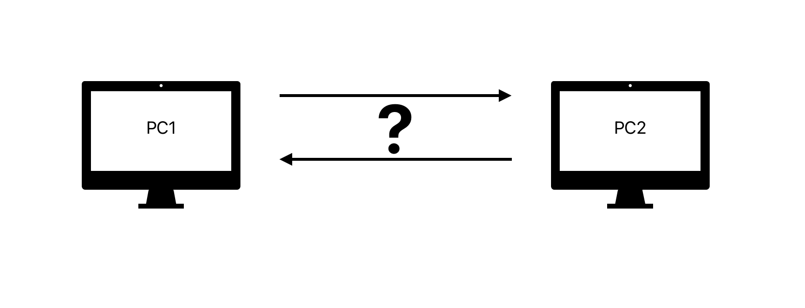
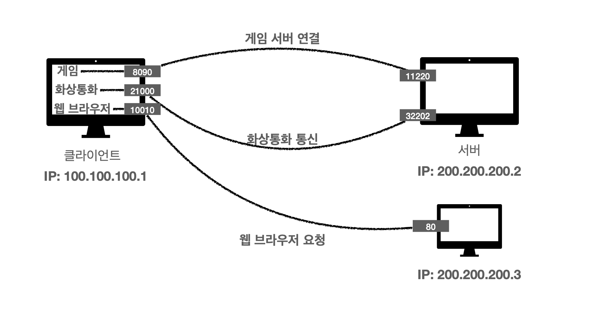
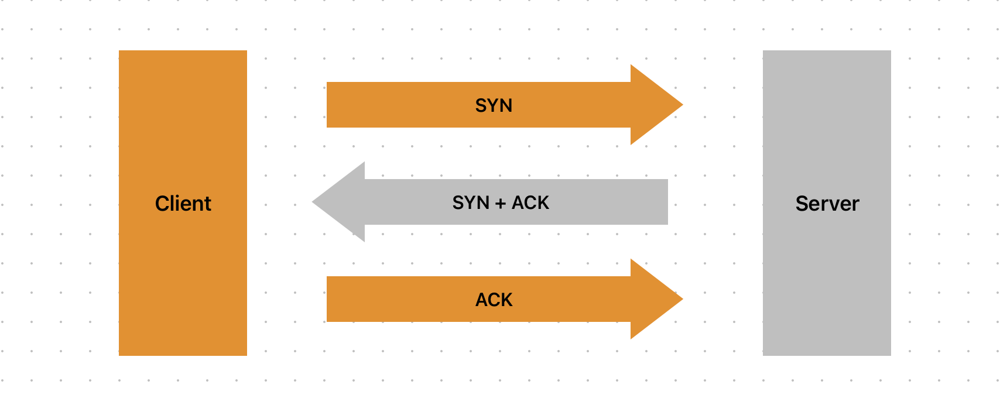
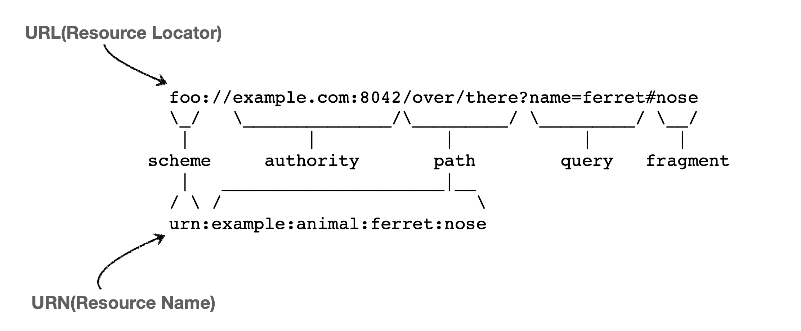
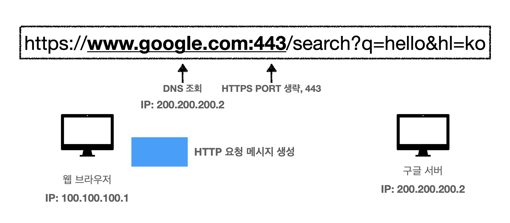
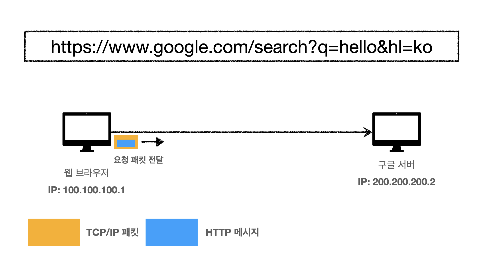
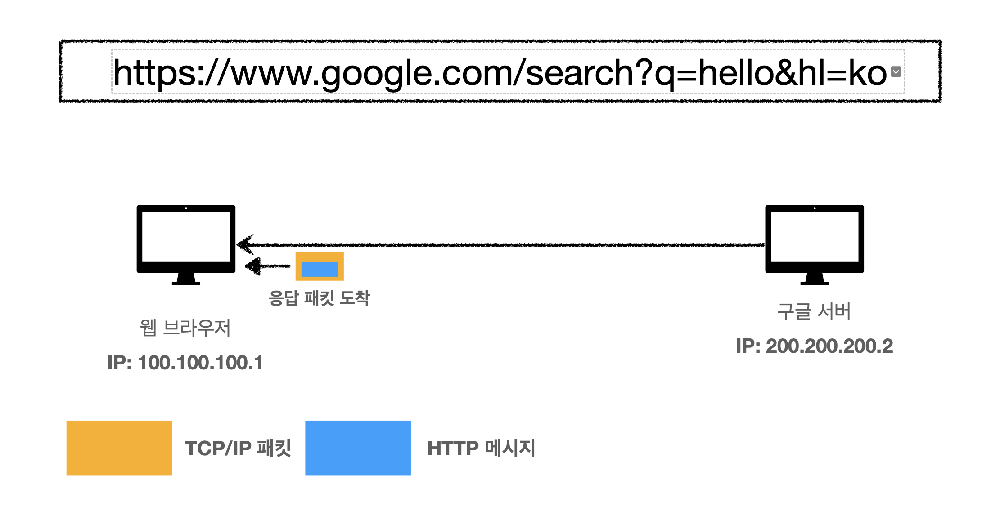

<h1> 인터넷 네트워크 </h1>

## 인터넷에서 컴퓨터 두 대는 어떻게 통신할까?

인터넷에서 컴퓨터 간 **통신**을 위해서는 IP(Internet Protocol) 주소가 필요하다.



---

### 1. IP(Internet Protocol)란?

IP는 지정된 IP 주소로 데이터를 **패킷(Packet)** 단위로 전달하는 프로토콜이다.
그런데 IP만으로는 안정적인 통신이 어렵다.

### IP의 한계

1. **비연결성** - 서버가 정상적으로 동작하는지 확인할 방법이 없음
2. **비신뢰성** - 패킷 손실 및 순서 문제 발생 가능
3. **프로그램 구분 불가능** - 동일한 IP 내 여러 프로그램을 구분할 수 없음

즉, IP만으로는 데이터 분실 가능성이 있으며, **`포트(Port)`** 개념이 없기 때문에 프로그램을 구분할 수 없다.

<aside>

### PORT란?

**IP는 컴퓨터(호스트)를 식별하지만, PORT는 해당 컴퓨터에서 실행되는 프로그램(프로세스)을 식별한다.**

> IP = 아파트 주소 / PORT = 몇 동 몇 호
>



### PORT의 특징

- **0 ~ 65535** 범위 내에서 할당 가능
- **0 ~ 1023**: 잘 알려진 포트(Well-known Port) → 특정 서비스가 예약하여 사용

| 프로토콜 | 포트 번호 |
| --- | --- |
| FTP | 20, 21 |
| TELNET | 23 |
| HTTP | 80 |
| HTTPS | 443 |
</aside>

이를 해결하기 위해 등장한 것이 **TCP(Transmission Control Protocol) 이다.**

---

## 2. TCP(Transmission Control Protocol)

TCP는 위에서 언급한 IP의 한계를 보완하는 **신뢰성 있는 프로토콜이다.**

### TCP의 특징

- **연결 지향**: TCP **3-way Handshake**를 통해 통신을 시작
- **신뢰성**: 데이터 전달 보장, 순서 보장
- **흐름 제어**: 네트워크 상태를 고려하여 데이터 전송 속도를 조절

<aside>

### 3-way Handshake



</aside>

### TCP를 통한 데이터 전달 흐름


1. 프로그램이 메시지를 생성
2. SOCKET 라이브러리를 통해 데이터를 전달
3. TCP 세그먼트(TCP Header + 메시지 데이터) 생성
4. IP 패킷(IP Header + TCP 데이터) 생성
5. 이더넷 프레임(Ethernet Frame) 생성하여 전송

> Q: 위의 과정에서 **3-way Handshake**는 언제 이루어질까?
>
>
> A: 2단계부터 진행 전에 이루어진다. **TCP 연결이 이루어지고, SOCKET 라이브러리를 통해 데이터를 전달하기 때문이다.**
>

> Q: 패킷 순서가 잘못되면?
>
>
> A: 수신 측(서버)은 클라이언트에게 **잘못된 패킷을 다시 보내달라고 요청한다.**
>

---

## 3. UDP(User Datagram Protocol)

**UDP는 IP와 거의 동일하지만, 포트(Port)와 체크섬(Checksum)이 추가된 프로토콜이다.**

### UDP의 특징

- **비연결성**: TCP처럼 연결을 맺지 않음
- 비신뢰성: 패킷 손실 및 순서 보장 기능이 없음
- **빠른 전송 속도**: TCP보다 가볍고 빠르게 데이터 전송 가능

특징을 살펴봤을 때, UDP는 신뢰성이 필요 없는 서비스에 적합하다. (예: 실시간 스트리밍)

<aside>

### 체크섬(Checksum)이란?

데이터 전송 중 오류가 발생했는지 확인하는 값으로, 패킷이 정상적으로 도착했는지 검증하는 역할

</aside>

> Q: 그렇다면 체크섬을 통해 오류 감지를 한다면, 재전송 기능이 있을까?
>
>
> A: 말 그대로, **오류 감지를 위한 기능이지, 오류 복구를 위한 기능이 아니다. 손상된 데이터를 걸러내고, 애플리케이션이 알아서 처리할 수 있도록 도와주는 역할을 할 뿐이다.**
>

---

## 4. DNS(Domain Name System)

IP 주소를 직접 입력하기 어렵기 때문에, **DNS는 사람이 기억하기 쉬운 도메인(URL)을 IP 주소로 변환한다.**

**예시)**

- `naver.com` → `223.130.195.200`
- `google.com` → `142.250.74.14`

> Q: DNS가 없다면?
>
>
> A: 웹사이트 접속 시마다 IP 주소를 직접 입력해야 하는 불편함이 발생
>

---

## 정리

✔️인터넷 통신을 위해서는 **IP 주소와 PORT**가 필요하다.

✔️ **PORT**는 같은 IP 내에서 여러 프로그램을 구분하는 역할을 한다.

✔️ **TCP**는 신뢰성을 보장하는 프로토콜이며, **3-way Handshake**를 통해 연결을 맺는다.

✔️ **UDP**는 빠른 전송이 가능하지만 신뢰성이 낮다.

✔️ **DNS**는 사람이 기억하기 쉬운 도메인을 IP 주소로 변환한다.

---

<h1> URI와 웹 브라우저 요청 흐름 </h1>

## URI란?

URI(Uniform Resource Identifier)는 **인터넷에서 특정 자원을 식별**하는 주소 체계이다.

### URI의 구성

URI는 크게 **URL(자원 위치)** 과 **URN(자원 이름)** 으로 나뉜다.



| **구분** | **설명** | **예시** |
| --- | --- | --- |
| **URL (Uniform Resource Locator)** | 리소스의 위치를 나타냄 | https://www.google.com/search?q=hello |
| **URN (Uniform Resource Name)** | 리소스의 고유한 이름 | urn:isbn:0451450523 |

하지만 **URN만으로는 자원을 찾기가 어렵기 때문에, 일반적으로 URL을 주로 사용한다.**

---

## URL 분석

### URL 전체 문법

```
scheme://[userinfo@]host[:port][/path][?query][#fragment]
```

**예시 URL**

```
https://www.google.com:443/search?q=hello&hl=ko
```

### URL의 주요 구성 요소

| **요소** | **설명** | **예시** |
| --- | --- | --- |
| **scheme** | 프로토콜 (자원 접근 방식) | `https` (HyperText Transfer Protocol Secure) |
| **userinfo@** | 사용자 정보 (거의 사용하지 않음) | `admin:password@` |
| **host** | 호스트명, 도메인 또는 IP 주소 | `www.google.com` |
| **port** | 접속하려는 포트 (일반적으로 생략됨) | `443` (HTTPS 기본 포트) |
| **path** | 리소스 경로 | `/search` |
| **query** | 쿼리 파라미터 (key=value) | `?q=hello&hl=ko` |
| **fragment** | HTML 내부 북마크 (서버로 전송되지 않음) | `#section1` |

<aside>

### Fragment (#fragment)란?

- **서버에 전송되지 않는 정보**로, HTML 문서 내에서 특정 위치(북마크)로 이동하는 용도로 사용됨.
- 예시: `https://example.com/page#section1` → 페이지 로드 후 `section1` 위치로 이동.
</aside>

---

# 웹 브라우저 요청 흐름

웹 브라우저가 URL을 입력받아 서버에 요청을 보내고, 응답을 받아 렌더링하는 과정을 살표보자.

## 1. DNS 조회

브라우저는 URL에서 **호스트명(Domain Name)** 을 추출하고, **DNS 서버를 통해 해당 도메인의 IP 주소를 조회**한다.

📌 예시:

```
www.google.com → 142.250.190.78 (IP 주소)
```

## 2. HTTP 요청 생성

브라우저는 **HTTP 요청 메시지**를 생성한다.



📌 **HTTP 요청 메시지 (GET 요청)**

```
GET /search?q=hello&hl=ko HTTP/1.1
Host: www.google.com
User-Agent: Mozilla/5.0
Accept: text/html
```

## 3. TCP/IP 패킷 생성 및 요청 패킷 전송

요청을 목적지 서버로 전송하기 위해 **TCP/IP 패킷을 생성하고, 네트워크를 통해 목적지 서버로 전송된다.**



- **IP 패킷**: 출발지 IP, 목적지 IP, 전송 데이터 포함
- **TCP 세그먼트**: 출발지 포트, 목적지 포트, 데이터 순서 정보 포함
- **이더넷 프레임**: 물리적 네트워크를 통해 전송

## 4. 서버의 HTTP 응답 반환

목적지 서버는 요청을 받아 **HTTP 응답 메시지**를 생성하고 클라이언트(브라우저)에게 반환한다.



📌 **HTTP 응답 메시지 예시**

```
HTTP/1.1 200 OK
Content-Type: text/html
Content-Length: 12345

<html>
  <body>
    <h1>검색 결과</h1>
  </body>
</html>
```

## 6. 브라우저가 HTML 렌더링

브라우저는 받은 HTML, CSS, JavaScript 등을 해석하여 **사용자 화면에 웹페이지를 렌더링**한다.

---

# 정리

✅ **URI는 자원을 식별하는 주소이며, URL이 가장 일반적으로 사용됨**

✅ **URL은 scheme, host, port, path, query 등의 요소로 구성됨**

✅ **웹 브라우저는 DNS 조회 → HTTP 요청 생성 → TCP/IP 패킷 전송 → HTTP 응답 처리 → 렌더링 순으로 동작함**