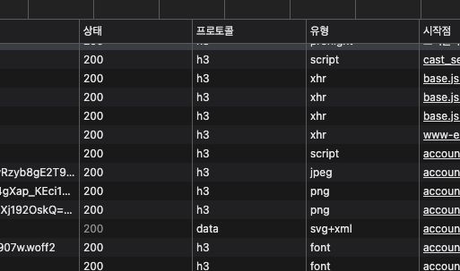
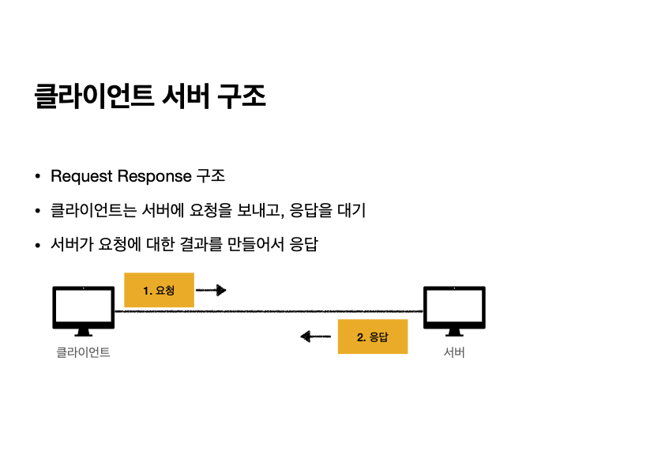
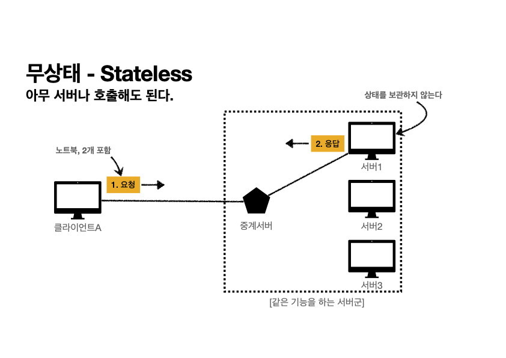
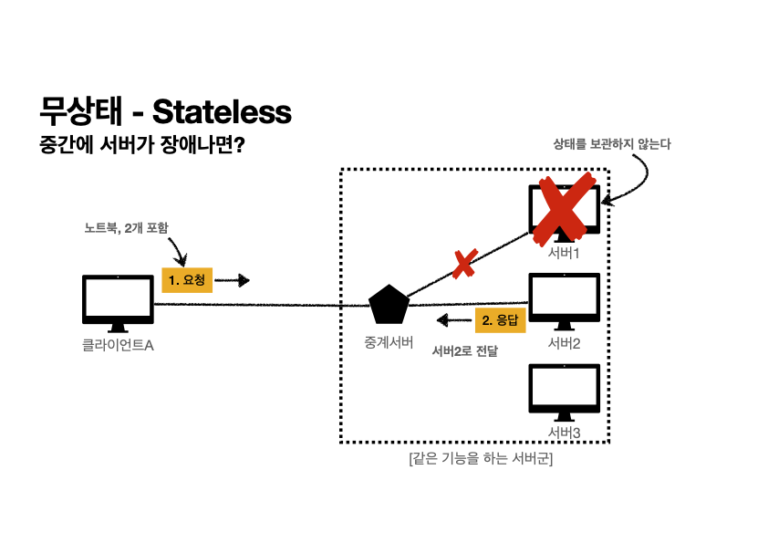
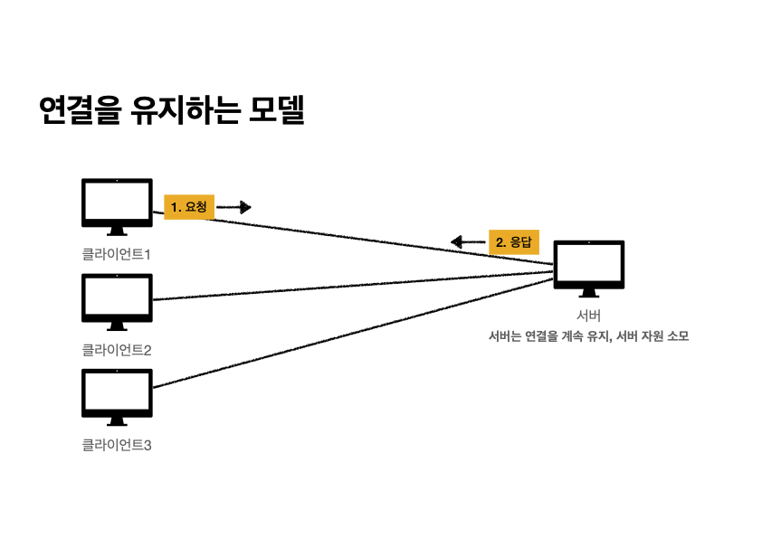
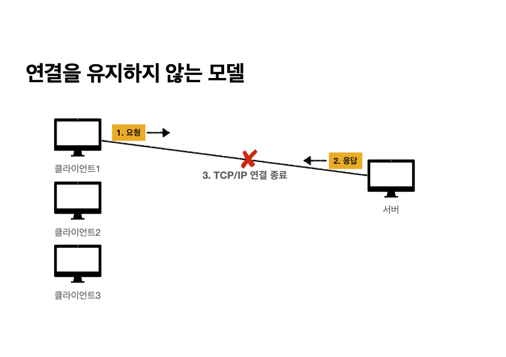
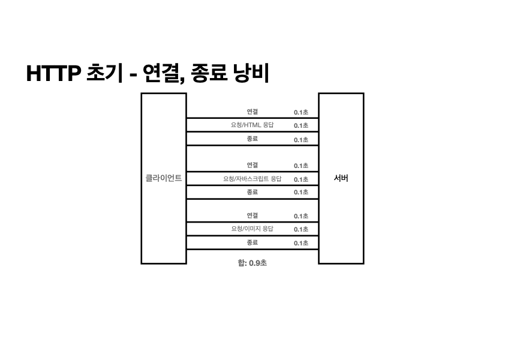
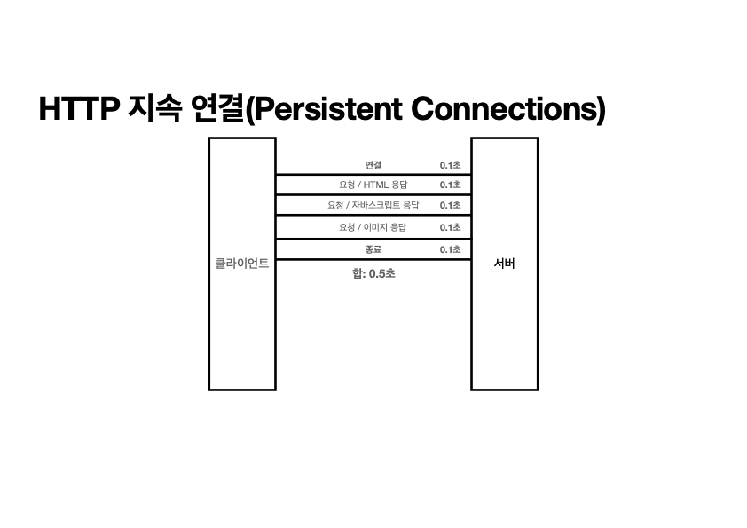
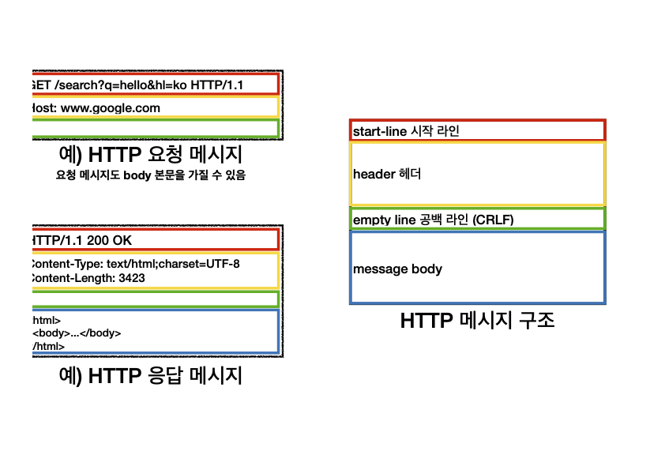

<h1> HTTP 기본 </h1>
HTTP 는 hypertext transfer protocol 의 약자로 애플리케이션 계층으로서 웹 서비스 통신에 사용된다.

초기에는 HTML 등 링크를 통해 연결 할 수 있는 문서(하이퍼텍스트)를 전송하는 프로토콜로 시작하였다. 
다만, 현재는 모든 형태의 데이터를 전송하는 프로토콜로 사용중이며, HTML 뿐만 아니라, TEXT, image, 음성, 영상, 파일, JSON, XML 형식의 데이터를 모두 전송할 수 있다. 
또한, 서버간 통신을 할 때도 대부분 http 프로토콜로 연결하고 있다.
---

## HTTP 역사

```
- HTTP/0.9 1991년: GET 메서드만 지원, HTTP 헤더X
- HTTP/1.0 1996년: 메서드, 헤더 추가
- HTTP/1.1 1997년: 가장 많이 사용, 우리에게 가장 중요한 버전
    RFC2068 (1997) -> RFC2616 (1999) -> RFC7230~7235 (2014)
- HTTP/2 - 2015년: 성능 개선
- HTTP/3 진행중: TCP 대신에 UDP 사용, 성능 개선
```

지금 우리가 가장 많이 사용하고, 가장 중요한 버전은 HTTP/1.1이다. 이 버전에는 웬만한 모든 기능이 포함되어 있으며, 이후에 등장한 HTTP/2와 HTTP/3은 성능 개선에 중점을 두고 있다.

---

## 기반 프로토콜
```angular2html
• TCP: HTTP/1.1, HTTP/2
• UDP: HTTP/3
• 현재 HTTP/1.1 주로 사용
• HTTP/2, HTTP/3 도 점점 증가
```

HTTP는 버전마다 사용하는 프로토콜이 다르다. HTTP/1.1과 HTTP/2는 TCP 기반으로 작동하는데, TCP는 3-way handshake 같은 연결 설정 과정이 필요하고, 기본적으로 속도가 빠른 방식이 아니다.

반면, HTTP/3는 성능을 개선하기 위해 UDP를 기반으로 설계되었으며, 이를 통해 애플리케이션 레벨에서 성능 최적화가 이루어졌다.

다만, 아직까지는 주로 HTTP/1.1을 쓰고 있지만, 각 HTTP 버전은 개발자 도구의 네트워크 탭에서 ‘protocol’ 항목을 열어 확인할 수 있다.



---

## HTTP 특징
### 클라이언트-서버 구조



HTTP는 클라이언트가 서버에 요청을 보내고, 서버는 그 요청에 대한 결과를 만들어 응답하는 클라이언트-서버 구조로 동작한다.

중요한 점은 클라이언트와 서버 개념을 분리하는 것인데, HTTP 덕분에 비즈니스 로직과 데이터 로직은 서버에서 처리되고, 클라이언트는 UI에 집중할 수 있게 되었다.

이 구조 덕분에 프론트엔드와 백엔드가 독립적으로 동작할 수 있게 되었고, 역할 분담이 명확해져 효율적인 개발이 가능해졌다.

---

### 무상태 프로토콜 : Stateless
HTTP는 무상태 프로토콜(stateless)을 지향한다. 즉, 서버는 각 요청을 독립적으로 처리하며, 이전 요청에 대한 정보를 저장하지 않는다. 이를 통해 서버의 부담을 줄이고, 요청마다 빠르고 효율적인 처리가 가능해진다

> Q : 그래서 무상태 프로토콜이 뭔데요 ?

> A : 무상태 프로토콜은 서버가 클라이언트의 상태를 저장하거나 기억하지 않는 프로토콜
> - 장점 : 서버 확장성 높음 (스케일 아웃)
> - 단점 : 클라이언트가 추가 데이터를 전송해야 함

### Stateful vs Stateless
**상태 유지 - Stateful**
```
고객: 이 노트북 얼마인가요?
점원: 100만원 입니다.

고객: 2개 구매하겠습니다.
점원: 200만원 입니다. 신용카드, 현금중에 어떤 걸로 구매 하시겠어요?

고객: 신용카드로 구매하겠습니다.
점원: 200만원 결제 완료되었습니다.
```

**상태 유지 - Stateful, 점원이 중간에 바뀌면?**
```
고객: 이 노트북 얼마인가요?
점원A: 100만원 입니다.

고객: 2개 구매하겠습니다.
점원B: ? 무엇을 2개 구매하시겠어요?

고객: 신용카드로 구매하겠습니다.
점원C: ? 무슨 제품을 몇 개 신용카드로 구매하시겠어요?
```

**상태 유지 - Stateful, 정리**
```
고객: 이 노트북 얼마인가요?
점원: 100만원 입니다. (노트북 상태 유지)

고객: 2개 구매하겠습니다.
점원: 200만원 입니다. 신용카드, 현금중에 어떤 걸로 구매 하시겠어요?
	(노트북, 2개 상태 유지)

고객: 신용카드로 구매하겠습니다.
점원: 200만원 결제 완료되었습니다. (노트북, 2개, 신용카드 상태 유지)
```

**무상태 - Stateless, 점원이 중간에 바뀌면?**
```
고객: 이 노트북 얼마인가요?
점원A: 100만원 입니다.

고객: 노트북 2개 구매하겠습니다.
점원B: 노트북 2개는 200만원 입니다. 신용카드, 현금중에 어떤 걸로 구매 하시겠어요?

고객: 노트북 2개를 신용카드로 구매하겠습니다.
점원C: 200만원 결제 완료되었습니다.
```

위 사례처럼 Stateful 의 경우, 중간에 점원이 바뀌면 새로운 점원은 이전 점원의 인수인계를 받지 못해 고객의 요청이 이해되지 않을 수 있다.

반면, Stateless의 경우에는 점원이 바뀌어도 고객이 필요한 정보를 모두 전달하면 새로운 점원이 문제 없이 다음 행동을 수행할 수 있다.





사진과 같이 Stateless 의 경우, 통신 간 서버 장애가 발생했을 때 다른 서버로 전달을 하면 될 뿐이고 고객은 해당 장애를 인지하지 못한다. 즉, <u>**고가용성이 보장**</u>된다는 것이다.

다만, Stateless 에도 현실적인 한계가 존재한다. 실무에서는 모든 것을 무상태로 설계할 수 없는 경우가 있는데, 예를 들어 로그인한 사용자는 로그인 상태를 서버에 유지해야 한다. 그렇지 않으면 매 요청마다 사용자가 로그인을 다시 해야 하는 상황이 발생한다. 그래서 일반적으로는 브라우저의 쿠키나 서버 세션 등을 이용해 상태를 유지한다.

> 물론 JWT 토큰 인증 방식을 채택하면 이 또한 Stateless 하게 처리할 수 있다 !

---

### 비 연결성 : Connectionless

HTTP는 Connectionless 라는 특징을 가진다. 이는 기본적으로 연결을 유지해야 하는 TCP/IP와는 반대되는 개념으로, HTTP는 각 요청마다 새로운 연결을 설정하고 요청이 끝나면 연결을 종료한다. TCP/IP는 서버와의 연결을 계속 유지해야 하므로 서버 자원이 소모되는 단점이 있지만, HTTP는 연결을 유지하지 않아 자원을 최소화할 수 있다는 장점이 있다.



이처럼 TCP/IP로 연결을 유지하면, 클라이언트 1이 통신을 주고 받는 동안 클라이언트 2와 클라이언트 3은 대기 상태에 있게 되어 자원이 낭비된다.



반면, HTTP는 한 번 서버와 통신을 수행한 후 연결을 유지하지 않기 때문에 자원을 효율적으로 사용할 수 있다. 이 덕분에 초 단위 이하의 빠른 속도로 응답할 수 있으며, 1시간 동안 수천 명이 서비스를 사용해도 실제 서버의 동시 처리 요청은 수십 개 이하로 매우 적다.

결과적으로, HTTP는 서버 자원을 매우 효율적으로 사용할 수 있는 프로토콜이다.

다만, 비연결성의 한계점도 존재한다. HTTP는 클라이언트와 서버가 서로 연결을 유지하지 않기 때문에, TCP/IP 프로토콜에 따라 연결과 종료를 반복할때 요청에 대한 응답을 여러번 반복하게 되면서 서버의 자원과 시간(3 way handshake 시간)이 낭비된다.

또한, 웹 브라우저 요청 시 HTML 하나만 받아오는게 아니라, 자바스크립트, css, 이미지등 수많은 파일들을 불러오는데, 연결이 되지 않는다면 파일 하나하나당 매번 요청을 보내야한다는 불편함이 있다.



이러한 문제점을 개선하기 위해, HTTP/1.1부터는 Keep-Alive 기능을 도입하여 지속 연결(Persistent Connection) 방식을 적용했다.



이처럼 HTML, JS, CSS 등의 데이터를 모두 내려받을 때까지 연결을 유지함으로써, 여러 번 연결을 설정하는 비용을 줄이고 더 효율적으로 작업을 수행할 수 있게 된다.

---

# HTTP 메시지



HTTP 메세지는 요청 메세지와 응답 메세지 크게 두 종류로 나뉘어져 있으며, 각각 형태가 조금씩 다르다. 기본적인 구조는 아래와 같다.

```
시작 라인 (start-line)
헤더 (header)
공백 라인 (CRLF, empty line)
바디 (message body)
```

## start-line
시작 라인은 크개 reqeust-line / status-line 으로 구분된다.
요청 메시지는 reqeust-line, 응답 메시지는 status-line 로 구성되는 것이다.

### 요청 메시지

```java
method SP(공백) request-target SP HTTP-version CRLF(엔터)
```

method : GET, POST, PUT, DELETE 등
target : 절대 경로와 쿼리
version : HTTP 버전 정보

### 응답 메시지
```java
HTTP-version SP status-code SP reason-phrase CRLF
```

status-code : HTTP 상태코드
reason-phrase : 상태 코드 설명 글


## Header

HTTP 헤더는 HTTP 전송에 필요한 모든 부가 정보를 담기 위해 생성된다.
ex) 인증,웹 브라우저 정보, 압축 등등

**메세지 바디 빼고 모든 메타데이터 정보가 다 들어있음**

## Body
마지막으로 HTTP 메세지 바디는 실제 전송할 데이터를 담고있다. 예를 들어, HTML 문서, 이미지, 영상, JSON 등 byte로 표현할 수 있는 모든 데이터가 바디가 될 수 있다.