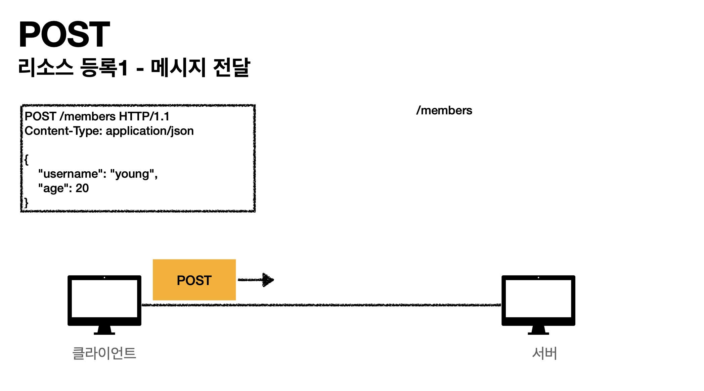
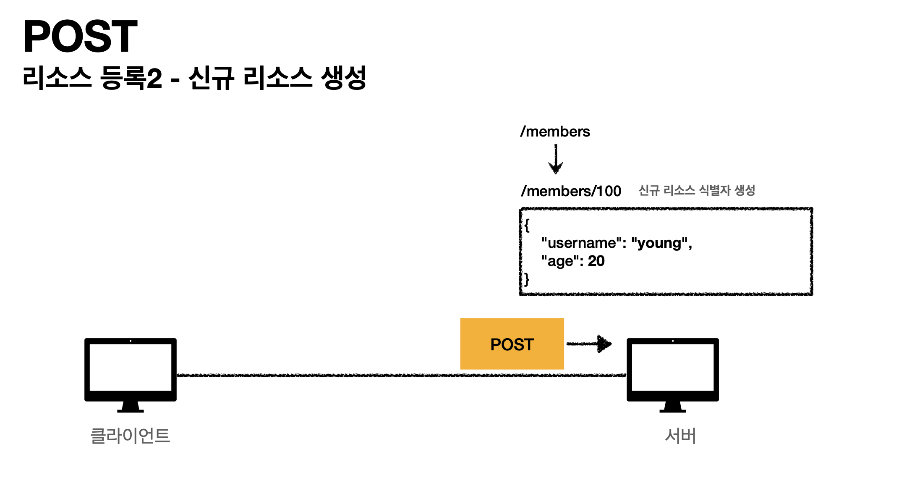
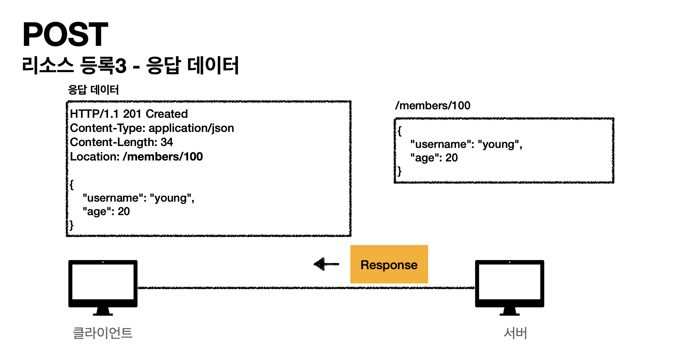

# API URI 설계

API 설계를 할 때 가장 중요한 것은 **리소스를 식별하는 것**이다.

예를 들어, 회원을 등록/수정/삭제에 관한 API 를 설계하고자 할 때, **회원 자체가 리소스**이다. URI 설계 시 리소스를 중심으로 정의해야 한다.

## 리소스 URI 예시

- 회원 목록 조회: `/members`
- 특정 회원 조회: `/members/{id}`
- 회원 등록: `/members`
- 회원 수정: `/members/{id}`
- 회원 삭제: `/members/{id}`

여기서 중요한 점은 **행위를 URI에 포함하지 않고, HTTP 메서드를 활용하여 의미를 전달**하는 것이다.

---

## HTTP 메서드 종류

### 주요 HTTP 메서드

| 메서드 | 목적 |
| --- | --- |
| `GET` | 리소스 조회 |
| `POST` | 요청 데이터 처리, 리소스 생성 또는 프로세스 처리 |
| `PUT` | 리소스 전체 대체 (없으면 생성) |
| `PATCH` | 리소스의 일부 수정 |
| `DELETE` | 리소스 삭제 |

---

### GET (리소스 조회)

- 서버에서 리소스를 조회할 때 사용
- 요청 데이터를 **쿼리 파라미터**로 전달 가능 (`/members?name=kim`)

**예시**
```
GET /members
```

---

### POST (리소스 생성 및 데이터 처리)

- 주로 **새로운 리소스를 생성**할 때 사용
- 메시지 바디를 통해 서버로 데이터를 전달
- 경우에 따라 **리소스를 생성하지 않고 프로세스를 처리**할 수도 있음
    - 컨트롤 URI 사용 `POST /orders/{orderId}/start-delivery`
- **POST는 단순히 리소스를 생성하는 것이 아니다!**







---

### PUT (리소스 전체 변경 또는 생성)

- 요청한 리소스가 존재하면 **전체 대체**, 존재하지 않으면 **새로 생성**
- 클라이언트가 **리소스를 식별**하여 요청해야 함

**예시**

```
PUT /members/100 { "age": 40 }
```

**결과**: 기존 `{name: "Kim", age: 35}` → `{age: 40}`

---

### PATCH (리소스 일부 변경)

- `PUT`과 달리 **일부 필드만 수정** 가능

**예시**

```
PATCH /members/100 { "age": 40 }
```

**결과**: 기존 `{name: "Kim", age: 35}` → `{name: "Kim", age: 40}`

---

### DELETE (리소스 삭제)

- 특정 리소스를 삭제할 때 사용

**예시**

```
DELETE /members/100
```


---

### 기타 HTTP 메서드

- **HEAD**
    - GET과 동일하지만 응답 본문을 제외하고 상태와 헤더만 반환
    - 예: `HEAD /users/1` → 상태 코드 200과 헤더만 반환, 본문 없음
- **OPTIONS**
    - 대상 리소스에서 지원하는 HTTP 메서드를 확인
    - 주로 CORS(교차 출처 리소스 공유)에서 사용됨
    - 예: `OPTIONS /users` → 응답 헤더에 `GET, POST, PUT, DELETE` 포함

  > **Q: CORS란?**  
  **A:** 교차 출처 리소스 공유(Cross-Origin Resource Sharing)의 약자로, 다른 도메인에서 오는 요청을 허용할지 결정하는 정책입니다. 브라우저는 보안상의 이유로 기본적으로 다른 도메인에서 오는 요청을 차단하지만, 서버에서 적절한 CORS 헤더를 설정하면 허용할 수 있습니다.

- **CONNECT**
    - 터널을 설정하여 프로토콜 변환 가능
    - 주로 프록시 서버에서 HTTPS 연결을 위해 활용됨
    - SSL(HTTPS)을 사용하는 웹사이트에 접속할 때 Connect를 사용
- **TRACE**
    - 요청 경로를 따라 네트워크 디버깅
    - 핑퐁 테스트와 같은 경우 사용
    - 클라이언트와 서버간 통신 관리 및 디버깅을 할 때 사용

---

## HTTP 메서드의 속성


### 안전(Safe Methods)

- **호출해도 리소스를 변경하지 않는다.**
- "읽기 전용(READ-ONLY)"이어야 한다

> **Q: 그래도 계속 호출해서, 로그 같은게 쌓여서 장애가 발생하면요?**  
> **A:** 안전(Safe)이라는 개념은 해당 리소스 자체에 대한 변경이 없다는 의미입니다. 즉, GET 요청을 수백 번 보내도 리소스의 데이터 자체는 변경되지 않습니다. 그러나 로그가 쌓이거나 부수적인 부하가 발생하는 것은 다른 문제이며, 이는 안전성의 범위에서 고려하지 않습니다.

---

### 멱등(Idempotent Methods)


- **한 번 호출하든 백 번 호출하든 결과가 동일하다.**
- 수학적으로 표현하면 `f(f(x)) = f(x)`

> **Q: 멱등이 왜 필요해?**  
> **A:** 자동 복구 메커니즘을 지원하기 위해 필요하다. 예를 들어, 서버가 TIMEOUT 등의 문제로 정상 응답을 주지 못했을 때, 클라이언트가 같은 요청을 다시 보낼 수 있다. 멱등성이 보장되면 여러 번 요청해도 동일한 결과가 보장되므로 안전하게 재시도할 수 있음

> **Q: 재요청 중간에 다른 곳에서 리소스를 변경해버리면?**  
> **A:** 멱등성은 특정 요청을 여러 번 반복했을 때 동일한 결과를 보장하는 개념. 하지만 다른 사용자가 데이터를 수정하는 경우까지 보장하지는 않는다. 예를 들어,
>
> - 사용자1: `GET /users/1` → `{username: A, age: 20}`
> - 사용자2: `PUT /users/1` → `{username: A, age: 30}`
> - 사용자1: `GET /users/1` → `{username: A, age: 30}`
>
> 사용자1이 두 번째 요청을 했을 때 값이 변경된 것은 사용자2의 영향 때문이지, 멱등성이 깨진 것이 아니다.  
> 단순히 같은 요청을 반복했을 때만 동일한 결과가 나와야 한다.

---

### 캐시 가능(Cacheable Methods)

- GET, HEAD, POST, PATCH는 캐시 가능. 하지만 실제로는 GET, HEAD 정도만 주로 캐시 사용
- POST, PATCH는 본문 내용까지 캐시 키로 고려해야 하는데 구현이 어렵기 때문에 일반적으로 캐시되지 않음

> **Q: 캐시 키의 기준은 무엇일까?**  
> **A:** 캐시를 저장할 때, 특정 요청을 구분할 수 있는 고유한 식별자가 필요. 일반적으로 캐시 키는 요청 URL이지만, POST나 PATCH의 경우 요청 본문까지 포함해야 정확한 캐싱이 가능하다.
